<h3>Compte Rendu Tp2</h3>

On considère le schéma suivant 

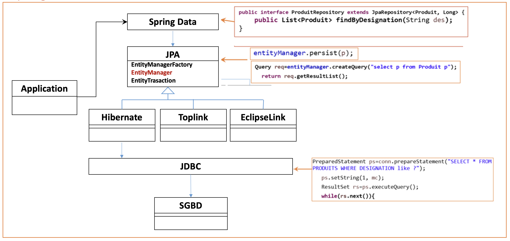

1. Création de l'entité JPA Patient

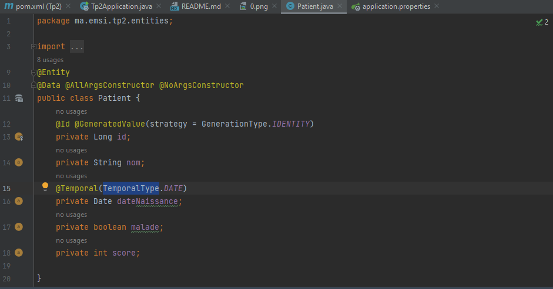

2. Configurer l'unité de persistance dans le ficher application.properties 

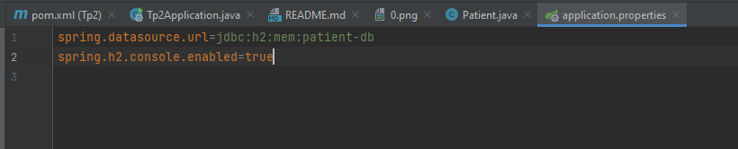

3. Création de l'interface JPA Repository basée sur Spring data

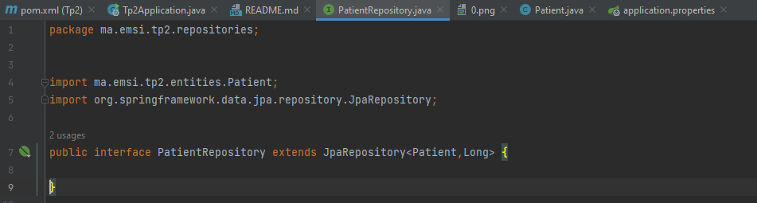

4. l'Ajout des patients :

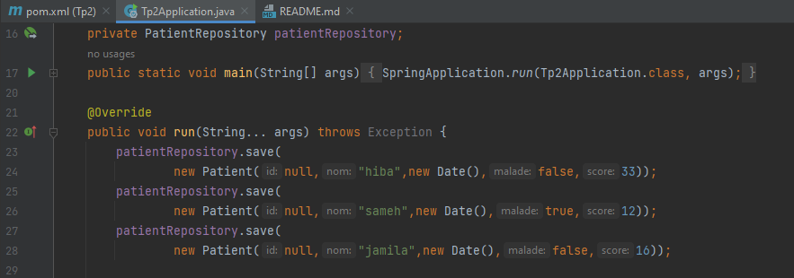

h2-console:

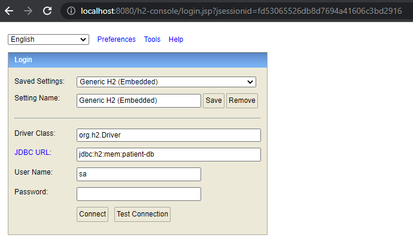

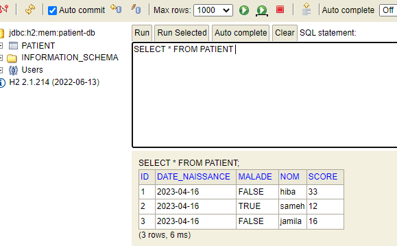

5. Consulter tous les patients

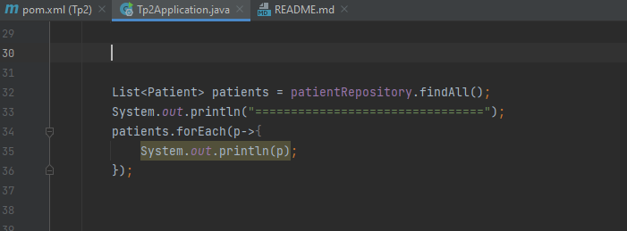

Resultat d'execution:

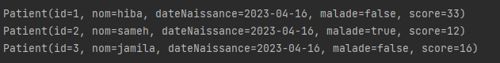

6. Consulter un patient by Id

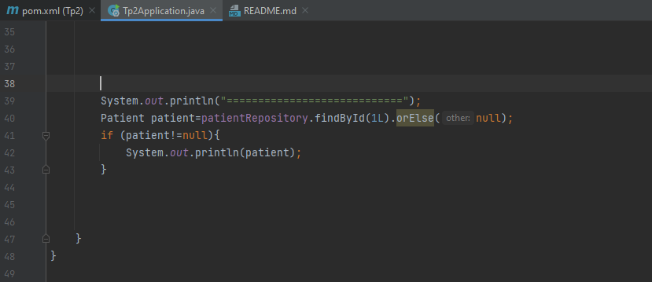

Resultat d'execution:

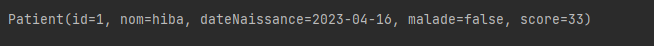

7. Chercher des patients

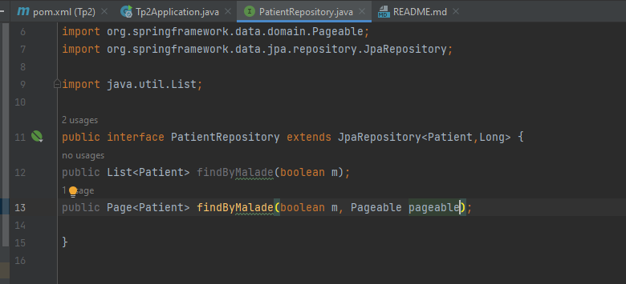

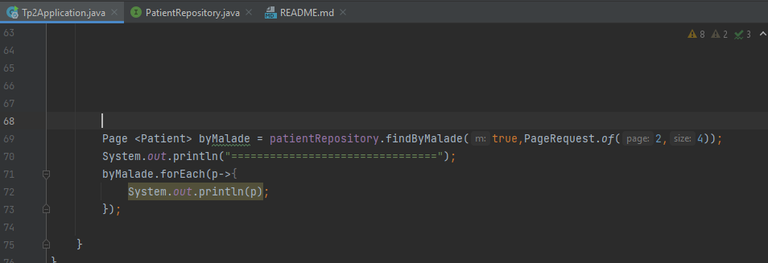

Resultat d'execution:

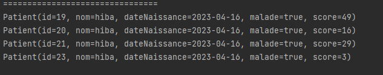

8. Mettre à jour un patient avec l'ID=1

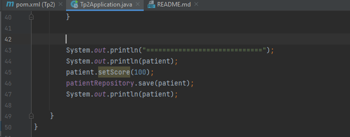

Resultat d'execution:

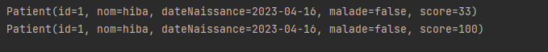

Verifier dans la BD:

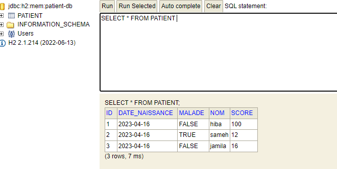

9. supprimer un patient

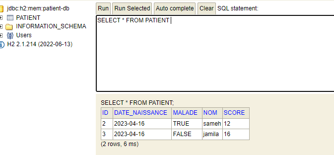

10. Migrer de H2 Database vers MySQL
pom.xml

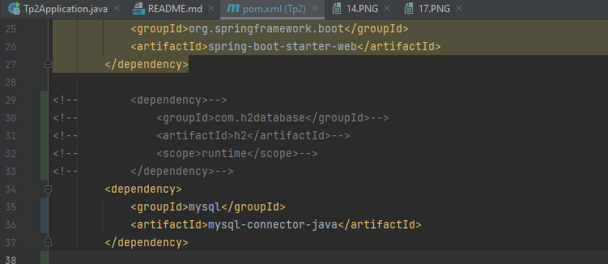

application.properties

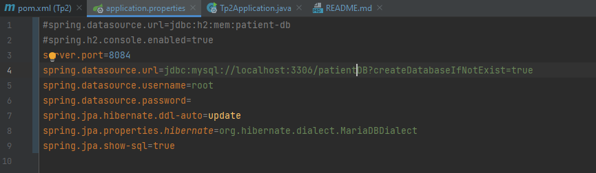

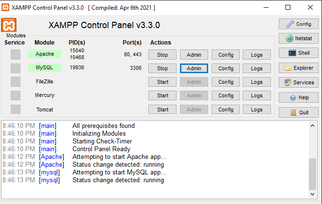

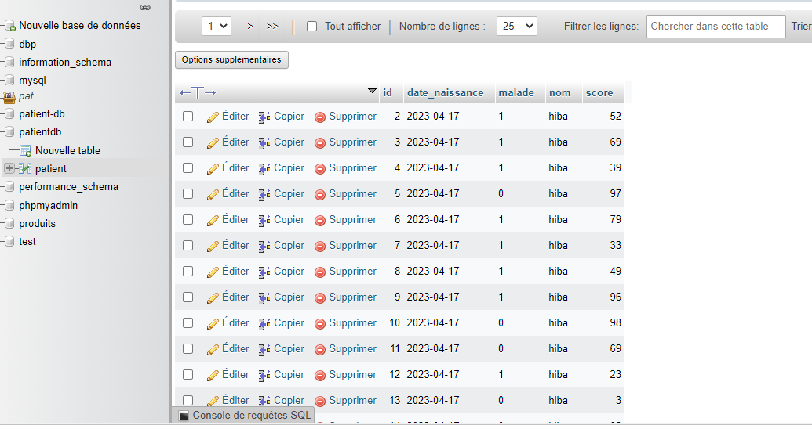

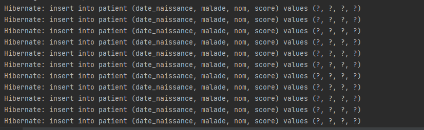

